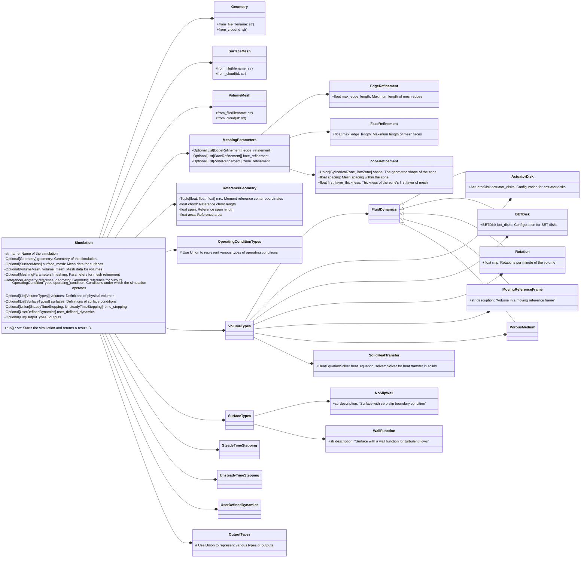

```mermaid
classDiagram
    direction LR

    
    class SteadyTimeStepping {
    }

    class UnsteadyTimeStepping {
    }

    class UserDefinedDynamics {
    }

    class OutputTypes {
        # Use Union to represent various types of outputs
    }

    class NoSlipWall {
        +str description: "Surface with zero slip boundary condition"
    }

    class WallFunction {
        +str description: "Surface with a wall function for turbulent flows"
    }

    class FluidDynamics {
    }

    class ActuatorDisk {
        +ActuatorDisk actuator_disks: Configuration for actuator disks
    }

    class BETDisk {
        +BETDisk bet_disks: Configuration for BET disks
    }

    class Rotation {
        +float rmp: Rotations per minute of the volume
    }

    class MovingReferenceFrame {
        +str description: "Volume in a moving reference frame"
    }

    class PorousMedium {
    }

    class SolidHeatTransfer {
        +HeatEquationSolver heat_equation_solver: Solver for heat transfer in solids
    }


    class Simulation {
        -str name: Name of the simulation
        -Optional[Geometry] geometry: Geometry of the simulation
        -Optional[SurfaceMesh] surface_mesh: Mesh data for surfaces
        -Optional[VolumeMesh] volume_mesh: Mesh data for volumes
        -Optional[MeshingParameters] meshing: Parameters for mesh refinement
        -ReferenceGeometry reference_geometry: Geometric reference for outputs
        -OperatingConditionTypes operating_condition: Conditions under which the simulation operates
        -Optional[List[VolumeTypes]] volumes: Definitions of physical volumes
        -Optional[List[SurfaceTypes]] surfaces: Definitions of surface conditions
        -Optional[Union[SteadyTimeStepping, UnsteadyTimeStepping]] time_stepping
        -Optional[UserDefinedDynamics] user_defined_dynamics
        -Optional[List[OutputTypes]] outputs
        +run() str: Starts the simulation and returns a result ID
    }

    
    class Geometry {
        +from_file(filename: str)
        +from_cloud(id: str)
    }

    class SurfaceMesh {
        +from_file(filename: str)
        +from_cloud(id: str)
    }

    class VolumeMesh {
        +from_file(filename: str)
        +from_cloud(id: str)
    }

    class MeshingParameters {
        -Optional[List[EdgeRefinement]] edge_refinement
        -Optional[List[FaceRefinement]] face_refinement
        -Optional[List[ZoneRefinement]] zone_refinement
    }

    class EdgeRefinement {
        +float max_edge_length: Maximum length of mesh edges
    }

    class FaceRefinement {
        +float max_edge_length: Maximum length of mesh faces
    }

    class ZoneRefinement {
        +Union[CylindricalZone, BoxZone] shape: The geometric shape of the zone
        +float spacing: Mesh spacing within the zone
        +float first_layer_thickness: Thickness of the zone's first layer of mesh
    }

    class ReferenceGeometry {
        -Tuple[float, float, float] mrc: Moment reference center coordinates
        -float chord: Reference chord length
        -float span: Reference span length
        -float area: Reference area
    }

    class OperatingConditionTypes {
        # Use Union to represent various types of operating conditions
    }


    SurfaceTypes --* NoSlipWall
    SurfaceTypes --* WallFunction

    VolumeTypes --* FluidDynamics
    VolumeTypes --* ActuatorDisk
    VolumeTypes --* BETDisk
    VolumeTypes --* Rotation
    VolumeTypes --* MovingReferenceFrame
    VolumeTypes --* PorousMedium
    VolumeTypes --* SolidHeatTransfer

    Simulation --* Geometry
    Simulation --* SurfaceMesh
    Simulation --* VolumeMesh
    Simulation --* MeshingParameters
    Simulation --* ReferenceGeometry
    Simulation --* OperatingConditionTypes
    Simulation --* VolumeTypes
    Simulation --* SurfaceTypes
    Simulation --* SteadyTimeStepping
    Simulation --* UnsteadyTimeStepping
    Simulation --* UserDefinedDynamics
    Simulation --* OutputTypes

    MeshingParameters --* EdgeRefinement
    MeshingParameters --* FaceRefinement
    MeshingParameters --* ZoneRefinement
    FluidDynamics <|-- ActuatorDisk
    FluidDynamics <|-- BETDisk
    FluidDynamics <|-- Rotation
    FluidDynamics <|-- MovingReferenceFrame
    FluidDynamics <|-- PorousMedium

```